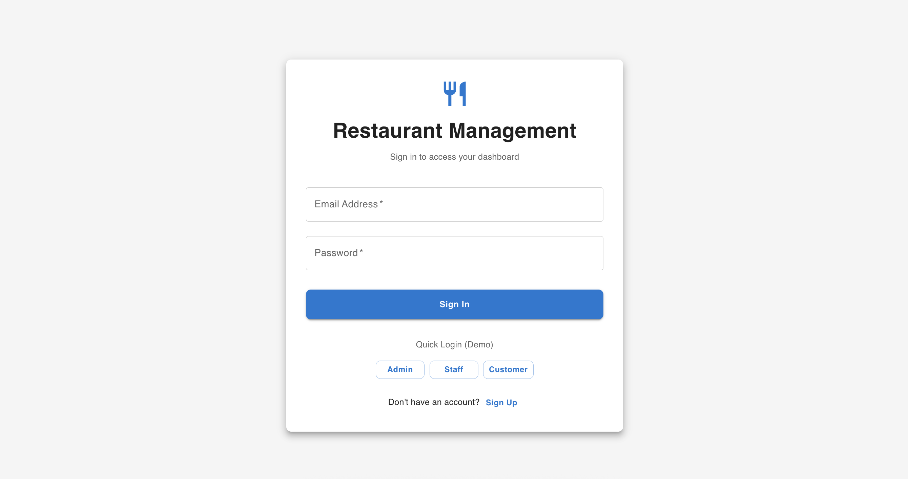
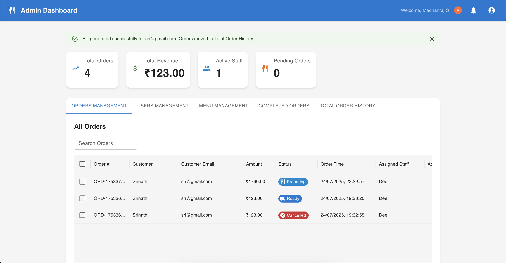
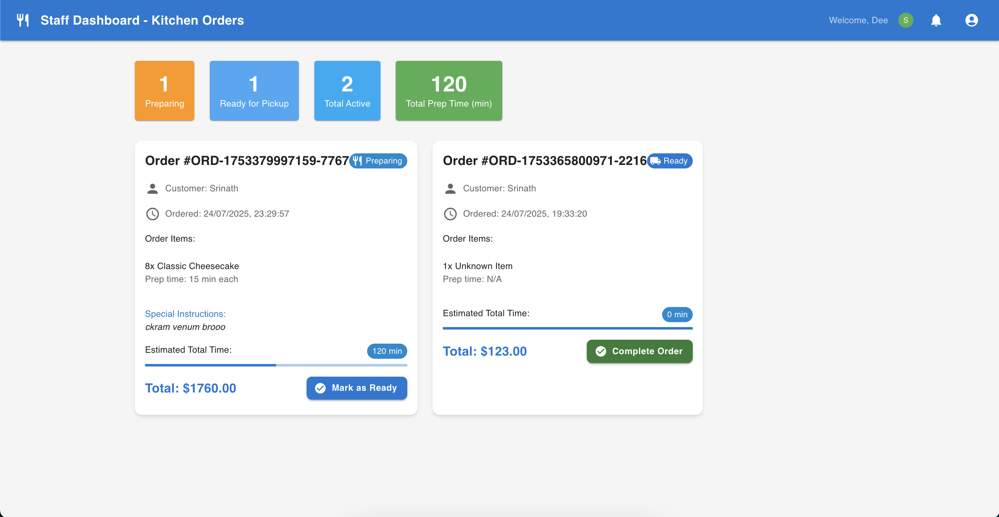
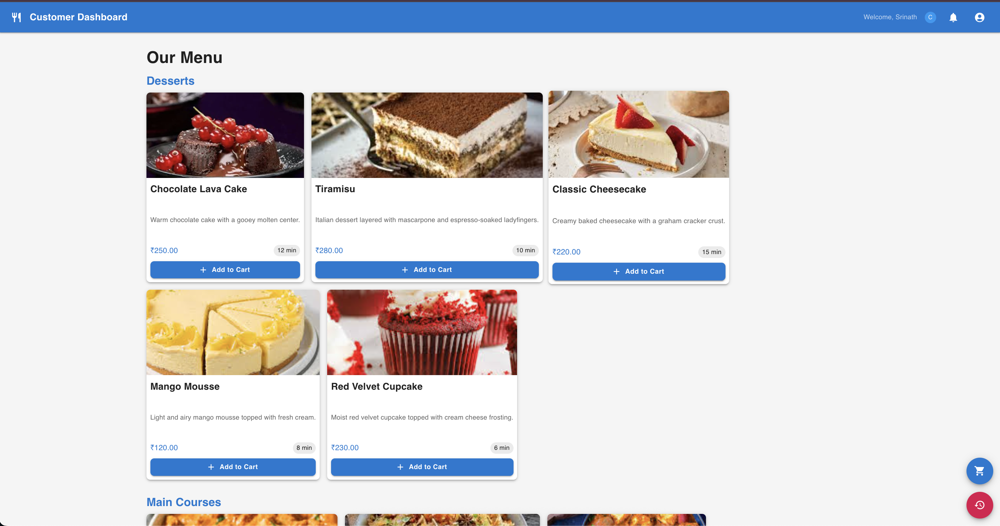
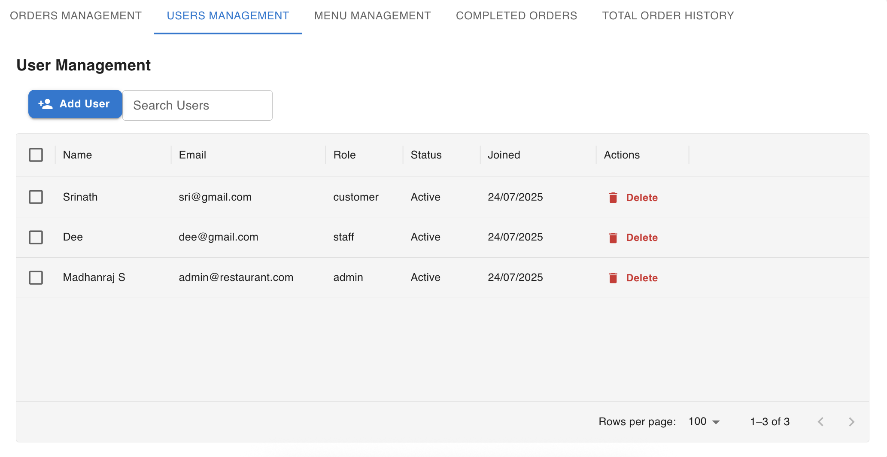
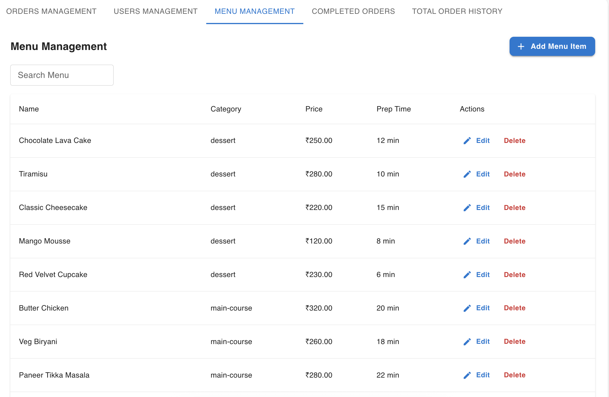
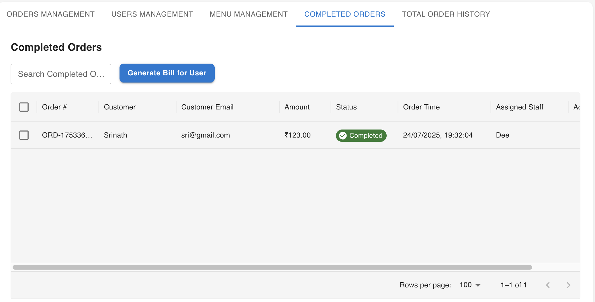
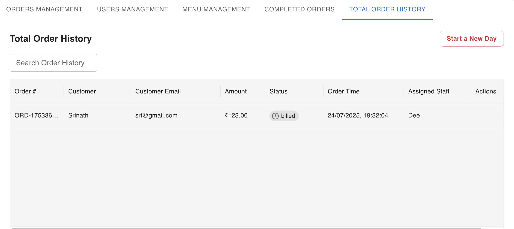

# 🍽️ Restaurant Management System

A modern, full-stack web application for managing restaurant operations, including menu, orders, and user roles. Built with a robust backend and a beautiful, responsive frontend. 🚀

---

## 🚦 Tech Stack

<p align="left">
  
  
  
  
  
  
  
</p>

---

## ✨ Features

- 📊 **Dashboards**: Role-based dashboards for Admin, Staff, and Customers.
- 🍔 **Menu Management**: Create, edit, delete, and view menu items.
- 🛒 **Order Management**: Place, update, and track orders in real-time.
- 🔔 **Live Order Status**: Real-time order updates using Socket.io.
- 🔒 **Authentication**: Secure login and registration for users with JWT.
- 🧑‍🤝‍🧑 **Role Management**: Admin, Staff, and Customer roles with different permissions.
- 📱 **Responsive UI**: Works beautifully on desktop and mobile.
- 🔍 **Search & Filter**: Quickly find menu items and orders.

---

## 📂 Folder Structure

```
restaurant_management/
  backend/    # Node.js, Express, MongoDB API
  frontend/   # React, Vite, MUI frontend
```

---

## 🚀 Getting Started

### 1. Clone the repository
```bash
git clone https://github.com/madhan404/Restaurant-Management-System.git
cd restaurant_management
```

### 2. Setup Backend
```bash
cd backend
npm install
# (Optional) Seed the database
node seedData.js
npm start
```


#### 2.1. Configure Environment Variables

- Copy the example environment file and edit it:
  ```bash
  PORT=3000
  MONGODB_URI= your mongodb uri
  JWT_SECRET= JWT_SECRET-key
  NODE_ENV = development
  ```
- Open `.env` and set your MongoDB URI, JWT secret, and any other required variables.


### 3. Setup Frontend
```bash
cd ../frontend
npm install
npm run dev
```

The backend runs on `http://localhost:3000` and the frontend on `http://localhost:5173` by default.

---

## 🖼️ Screenshots

### Login Page


### Admin Dashboard


### Staff Dashboard


### Customer Dashboard


### User Management


### Menu Management


### Bill Generation


### Order History



---

## 🤝 Contributing

Pull requests are welcome! For major changes, please open an issue first to discuss what you would like to change.

---

## 📄 License

This project is licensed under the MIT License. See the [LICENSE](LICENSE) file for details.

---

## 🙋‍♂️ Contact

Created by [Madhanraj S](https://github.com/madhan404) and [Deenan T](https://github.com/Dee2909) — feel free to reach out!

## ❤️ live preview : [Restaurant Management App](https://restaurant-managementsystem.netlify.app/customer)  <!-- Production only, use localhost for local dev -->
